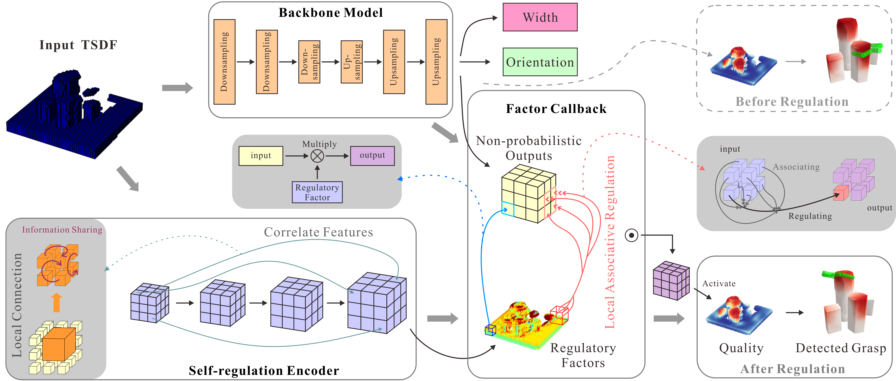

# Trustworthy Robotic Grasping: A Credibility Alignment Framework via Self-regulation Encoding

[Hang Yu](https://rh.nankai.edu.cn/info/1037/1144.htm), [Xuebo Zhang](https://rh.nankai.edu.cn/info/1016/1136.htm), [Zhenjie Zhao](https://rh.nankai.edu.cn/info/1016/1169.htm), [Cheng He](https://rh.nankai.edu.cn/info/1017/1112.htm)

IEEE/ASME TRANSACTIONS ON MECHATRONICS (under review) 2025

## Introduction
Although deep learning models may achieve successful grasps in some instances, they often struggle to accurately reflect the true likelihood of success for a given grasp. In this paper, we introduce the trustworthy robotic grasping problem, aiming to bridge the gap between predicted grasp probabilities and actual grasp success rates. We propose a novel credibility alignment framework through a two-branch network architecture. This architecture generates an adjusting tensor for non-probabilistic outputs prior to the activation function of the backbone model, which is able to scale the output proportionally to improve the reliability of the predicted probability. To learn the adjusting tensor, a novel self-regulation encoder has been designed, which can extract 3D local features of the scene for the local associative regulation of non-probabilistic outputs. To facilitate research in this area, a new Trustworthy Robotic Grasping dataset has been created. Experimental results reveal that our method not only significantly reduces the expected grasp error, maximum grasp error, and latter half expected grasp error by up to 50% compared to the pre-credibility alignment state, but also enhances both the grasp success rate and declutter rate. Real-world experiments on a Franka Panda robot arm further validates the efficacy of our method. our results are shown in `data/picture`.




* [Installation](#installation)
* [Data Processing](#data-processing)
* [Backbone Model Training](#backbone-model-training)
* [Self-regulation Encoder Training](#self-regulation-encoder-training)
* [Simulated Grasping](#simulated-grasping)
* [Real-world Grasping](#real-world-grasping)

## Installation

The following instructions were tested with `python3.8` on Ubuntu 20.04.


Clone the repository into the `src` folder of a catkin workspace, and source the catkin workspace.

```
git clone https://github.com/lalayh/trg
```

Create a conda environment.

```
conda create -n trg python=3.8
```

Activate the conda environment.

```
conda activate trg
```

Install packages list in [requirements.txt](requirements.txt). Please make sure to install the packages with the exact versions specified in the [requirements.txt](requirements.txt) file, otherwise the results may not be reproducible due to issues caused by random seeds.

```
pip install -r requirements.txt -i https://mirrors.tuna.tsinghua.edu.cn/pypi/web/simple
```

Go to the root directory and install the project locally using `pip`.

```
pip install -e .
```


## Data Processing

We reprocess the datasets generated by [Jiang et al.](https://github.com/UT-Austin-RPL/GIGA) for the [packed](https://utexas.box.com/shared/static/h48jfsqq85gt9u5lvb82s5ft6k2hqdcn.zip) and [pile](https://utexas.box.com/shared/static/l3zpzlc1p6mtnu7ashiedasl2m3xrtg2.zip) scenes to create our dataset, TRG. Place the two downloaded archive files in the `data/datasets` directory and extract them. Then, run:
#### Generate Packed Scene Data
```
python scripts/data_process.py --dataset ./data/datasets/ --scene packed
```

#### Generate Pile Scene Data
```
python scripts/data_process.py --dataset ./data/datasets/ --scene pile
```

* You can also directly download our pre-generated dataset [here](https://huggingface.co/datasets/lalayh/trg_dataset/blob/main/datasets.zip), place it in the `./data` directory, and then extract it.

## Backbone Model Training
#### Packed
```
python scripts/train_vgn.py --dataset data/datasets/data_packed_train_processed_dex_noise/
```
#### Pile
```
python scripts/train_vgn.py --dataset data/datasets/data_pile_train_processed_dex_noise/
```
Training and validation metrics are logged to TensorBoard and can be accessed with

```
tensorboard --logdir data/runs
```

## Self-regulation Encoder Training
#### Packed
```
python scripts/train_se_vgn.py --dataset data/datasets/data_packed_train_processed_dex_noise/ --model data/models/vgn_conv_packed_retrain.pt
```
#### Pile
```
python scripts/train_se_vgn.py --dataset data/datasets/data_pile_train_processed_dex_noise/ --model data/models/vgn_conv_pile_retrain.pt
```

## Simulated Grasping

Run simulated clutter removal experiments.

#### VGN-O(packed)
```
python scripts/sim_grasp.py --model data/models/vgn_conv_packed_o.pt --scene packed --object-set packed/test --result-path data/results/packed/packed --force --sideview
```

#### VGN-O(pile)
```
python scripts/sim_grasp.py --model data/models/vgn_conv_pile_o.pt --scene pile --object-set pile/test --result-path data/results/pile/pile --force --sideview
```

#### SE-VGN(packed)
```
python scripts/sim_grasp.py --model data/models/vgn_conv_packed_se.pt --scene packed --object-set packed/test --result-path data/results/packed/packed --force --sideview --calibration
```

#### SE-VGN(pile)
```
python scripts/sim_grasp.py --model data/models/vgn_conv_pile_se.pt --scene pile --object-set pile/test --result-path data/results/pile/pile --force --sideview --calibration
```

## Real-world Grasping

We use a Franka Panda robotic arm equipped with an Intel RealSense D435 camera to perform grasping. The hardware drivers for the robotic arm can be obtained from the [official Franka website](https://franka.de/). Our computer system is Ubuntu 20.04. Run the MoveIt and trg scripts in the ROS Noetic environment.

First, in the first terminal, launch the robot and camera drivers: 

```
roslaunch trg panda_grasp.launch
```

Then, in the second terminal, run

#### VGN-O(packed)
```
python scripts/panda_grasp.py --model data/models/vgn_conv_packed_o.pt --save_path data/results/packed/packed_0.5_0.6.npy --interval-upper 0.6
```

#### VGN-O(pile)
```
python scripts/panda_grasp.py --model data/models/vgn_conv_pile_o.pt --save_path data/results/pile/pile_0.5_0.6.npy --interval-upper 0.6
```

#### SE-VGN(packed)
```
python scripts/panda_grasp.py --model data/models/vgn_conv_packed_se.pt --save_path data/results/packed/packed_0.5_0.6.npy --interval-upper 0.6 --calibration
```

#### SE-VGN(pile)
```
python scripts/panda_grasp.py --model data/models/vgn_conv_pile_se.pt --save_path data/results/pile/pile_0.5_0.6.npy --interval-upper 0.6 --calibration
```

## Pre-trained models

Pretrained models are in the [data.zip](https://huggingface.co/lalayh/3DSPGNet/resolve/main/data.zip). They are in `data/models`.

## Related Repositories

1. Our code is largely based on [VGN](https://github.com/ethz-asl/vgn)

## Citing

```
@article{TBD,
 title={Trustworthy Robotic Grasping: A Credibility Alignment Framework via Self-regulation Encoding},
 author={Hang Yu, Xuebo Zhang, Zhenjie Zhao, Cheng He},
 journal={IEEE/ASME TRANSACTIONS ON MECHATRONICS(under review)},
 year={2025},
}
```
